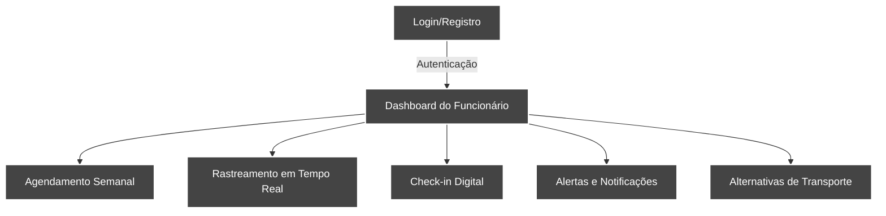
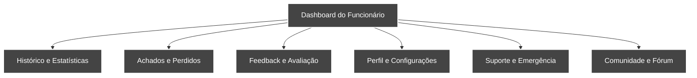
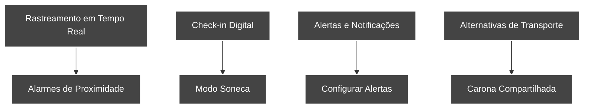
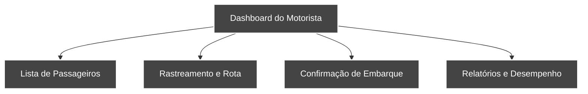

Este diagrama representa o fluxo do aplicativo de fretado, incluindo as principais funcionalidades tanto para os funcionários quanto para os motoristas.

1. Fluxo principal do usuário:

2. Funcionalidades secundárias do usuário:

3. Funcionalidades específicas:

4. Fluxo do motorista:

